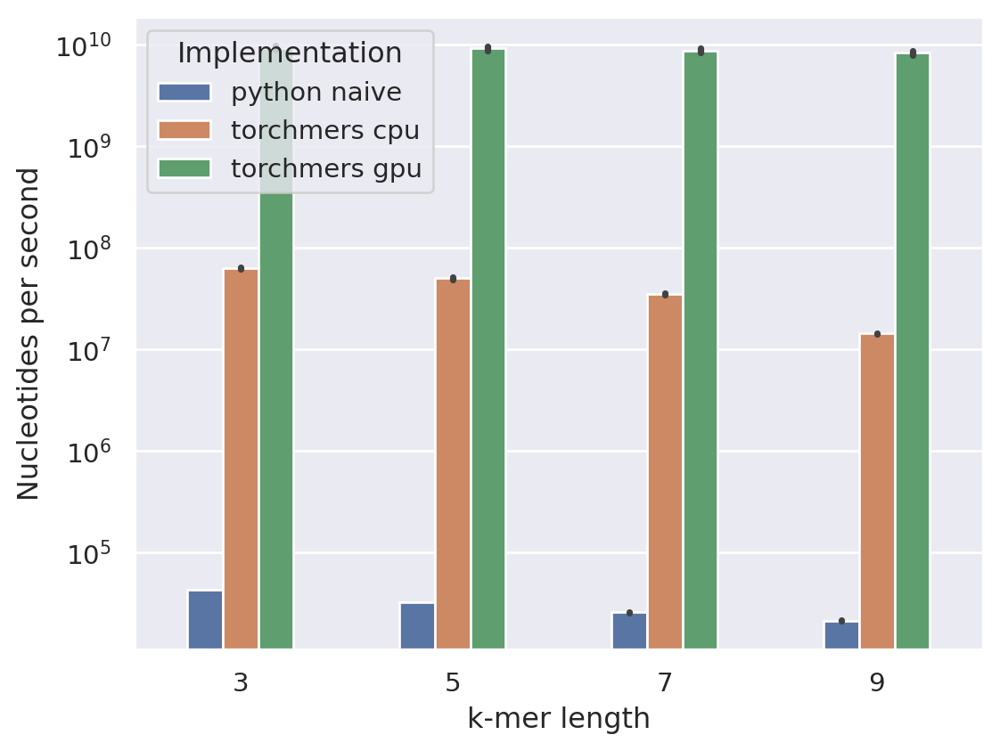

torchmers
=========

Efficient k-mer counting implemented with PyTorch primitives and out-of-the-box GPU support.

**Features:**

* ⚡ **Blazingly fast.** Count 9-mers over the entire human genome in just about 30 seconds on a desktop GPU.
* ⚡ **Flexible.** User friendly Python API. CLI soon to come.
* ⚡ **GPU acceleration.** Supports Nvidia GPUs and most other PyTorch hardware backends.
* ⚡ **Deep Learning ready.** Easy integration into PyTorch-based deep learning models.
* ⚡ **Format agnostic.** Works on any kind of sequence. Built-in tokenizers include 4 letter DNA or 20 letter amino acid codes. Natural language can be used as well.


Motivation
----------

K-mer frequency analysis is a simple yet highly important tool for genomics. Practitioners typically have to choose between two options: (1) implementations in scripting languages such as Python that are slow but flexible, or (2) tools in compiled languages that are efficient but might have limiting APIs.

Why can't we get the best of both worlds? While PyTorch and similar frameworks have been developed specifically for deep learning applications, after all, they offer highly efficient implementations of numerical operations optimized for vector operations on CPUs and numerous hardware accelerators. With a bit of hacking, these primitive operations can be utilized for compute-intensive problems in genomics such as k-mer counting, which are typically not treated as numerical problems.

### How does it work?

`torchmers` is based on two primitive PyTorch operations: `unfold` and `scatter_add`. With `unfold` sliding local blocks are extracted from a tensor, similar to a conv layer. Each value within a block is shifted depending on its position and all values within a block are summed to get a unique value for each possible k-mer. `scatter_add` is then used to simply add the k-mer indices to a count tensor. Some additional hacks are required to deal with padding or varying sequence lengths, but that's a topic for another time.

Usage
-----

### Installation

```bash
pip install torchmers
```

The [bioseq](https://github.com/dnbaker/bioseq.git) package should additionally be installed from GitHub for tokenization support:

```bash
pip install git+https://github.com/dnbaker/bioseq.git
```

Since it didn't has been published on PyPI, it can't be included in the package's dependencies (prove me better if I'm wrong).

### Functional API

The main k-mer counting logic of the package is implemented by the `count_k_mers` function. It expects sequences to be already tokenized, or rather _numericalized_ and to be provided as either NumPy or PyTorch arrays. To convert a biological sequence into this format, a `Tokenizer` can be used.

```python
from torchmers import Tokenizer, count_k_mers

sequence = 'CGCTATAAAAGGGC'

tokenizer = Tokenizer.from_name('DNA')
tokens = tokenizer.encode(sequence)

counts = count_k_mers(tokens, k=5)
```

#### GPU-support

`torchmers` uses PyTorch primitives under the hood. As long as PyTorch implements `unfold` and `scatter_add` operations for a hardware backend, among others, it can in principle be used for accelerated k-mer counting. This includes, of course, Nvidia GPUs, TPUs, and possibly Apple M CPUs, although I don't have any hardware to test this in the latter case.

The `count_k_mers` will simply use the device of the sequence tensor it has been provided, but this can also be overwritten with the `device` argument:

```python
# Both options are equivalent
tokens = torch.tensor(tokenizer.encode(sequence), device='cuda')

counts = count_k_mers(tokens, k=5, device='cuda')
```

### PyTorch Module API

`torchmers` provides a PyTorch `Module` which can be integrated into neural networks to encode (DNA) sequences into k-mer spectra.

```python
import torch
import torch.nn as nn

from torchmers.modules import KMerFrequencyEncoder

sequences = torch.randint(0, 3, (32, 256))

encoder = KMerFrequencyEncoder(k=5),
encoder(sequences)  # [32, 4 ** 5]
```

Note that `KMerFrequencyEncoder` expects input sequences to be numericalized and formatted as PyTorch tensors.

#### Padding

If sequences have been padded, a tensor with sequences lengths of shape `[batch_size]` can be passed as `seq_lens` argument to `KMerFrequencyEncoder.forward()`. Alternatively, a boolean mask of shape `[batch_size, seq_len]` is supported  as well, where tokens marked with `False` will not be considered for k-mer counting.

Examples
--------

The `examples/` folder contains Jupyter notebooks with different usage examples.

Benchmarks
----------



**Note:** The "python native" implementation is certainly not highly optimized but should represent a simple Python baseline. The GPU benchmarks have been created on a RTX 4090.

Contributing
------------

Contributions are welcomed. Please run tests with `python -m pytest tests/` to test your work before submitting.

Future work
-----------

This project started out of frustration with slow on-the-fly computation of k-mer frequency spectra for deep learning applications when done in pure Python. I don't have very many other personal use cases, but I would be glad if users could provide me with their feature requests.
